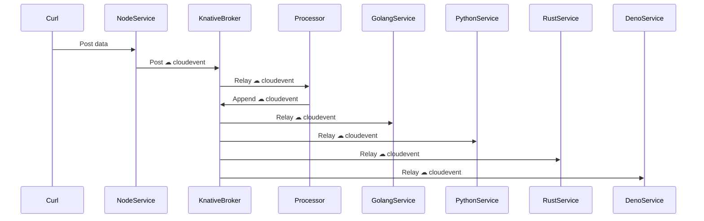
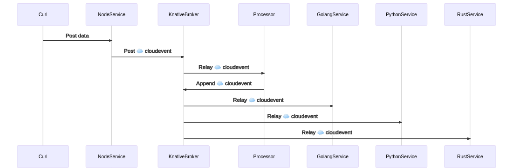
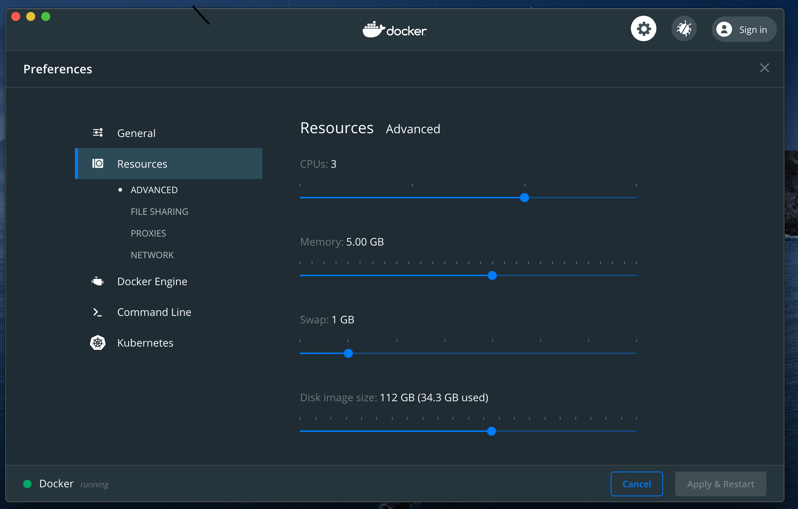
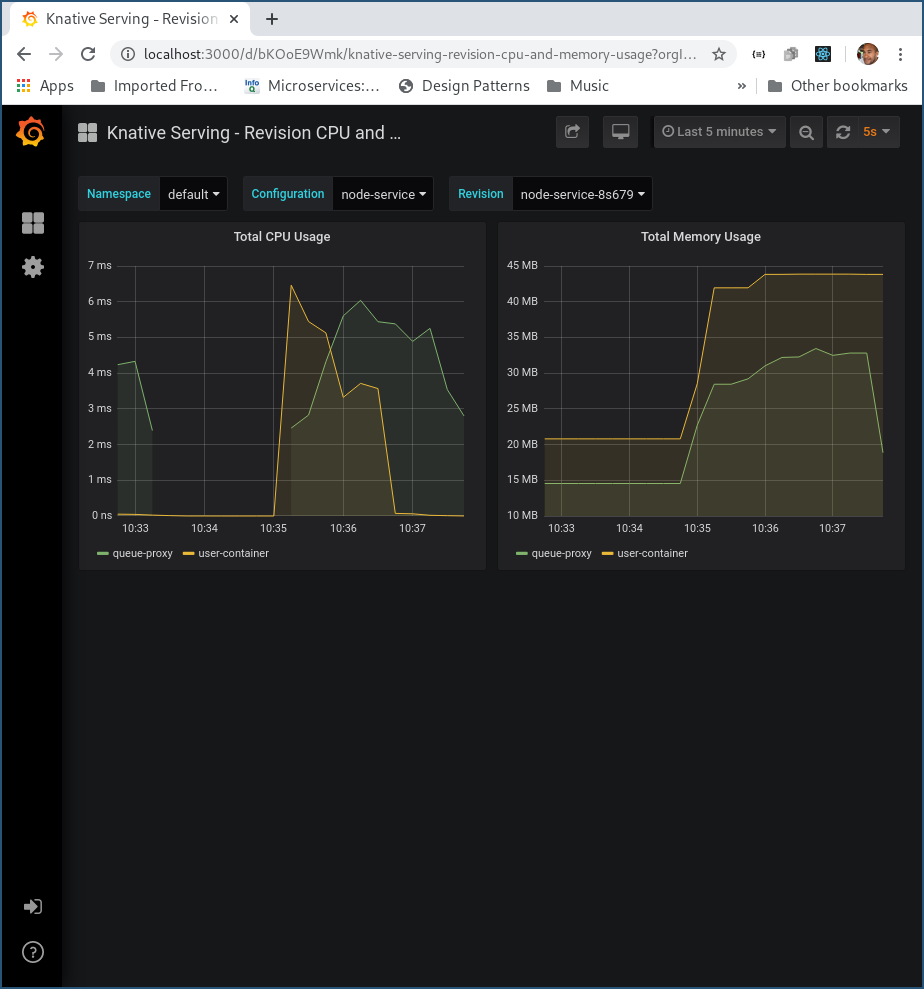
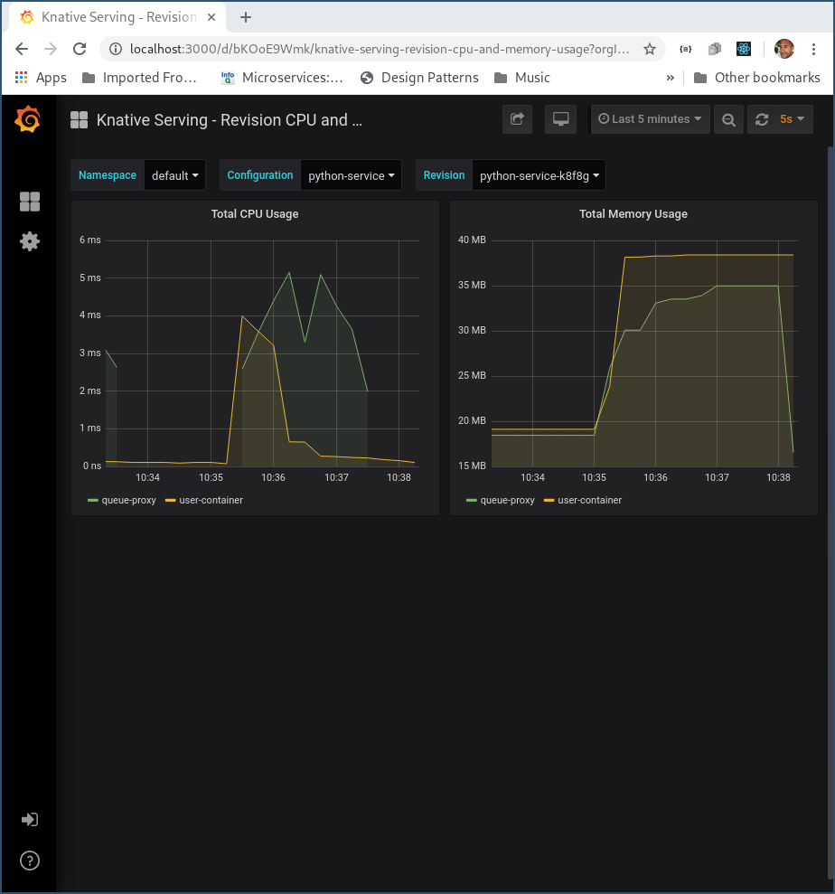
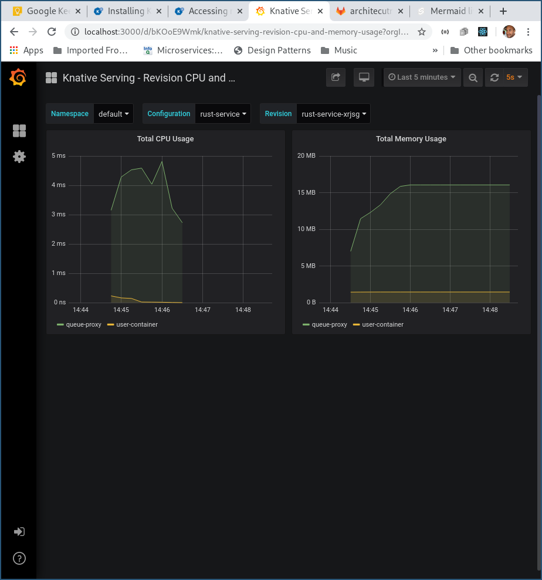

# Learning Knative - Quickstart

Local Knative dev environment

- Kourier or Istio
- Kafka or in-memory broker
- Kind or K3D
- Loki observability

# Introduction

The outcome of this exercise is a setup where services written in multiple languages get auto-scaled as [cloudevents](https://cloudevents.io/) arrive.

<!--

-->


## Prerequisites

### Kubernetes Distro

This project provides scripts for setting up Knative using either of the following distros

- [Kind](https://kind.sigs.k8s.io/)
- [k3d](https://k3d.io/)

### Apple Mac OSX

- Docker for Mac
- Correctly configured [Docker for Mac](https://docs.docker.com/docker-for-mac/install/) instance
  
  - At least 3 CPUs
  - At least 5 GB of RAM
- Kubernetes development tools
  ```bash
  brew install kubectl
  brew install kind
  brew install k3d
  brew install istioctl
  brew install helm
  ```

### Linux

- Docker
  ```bash
  yay docker
  ```
- Kubernetes development tools
  ```bash
  yay kubectl
  yay kind
  yay rancher-k3d-bin
  yay istio
  yay helm
  ```

## Getting started

Select Kubernetes Distro

- Kind
    ```bash
    ./local/dev-kind

    ```
- k3ds
    ```bash
    ./local/dev-k3ds

    ```

## Examples

1. Install example App
    ```bash
    kubectl apply -f ./examples/services.yaml
    ./examples/triggers
    kubectl wait ksvc node-service --for=condition=Ready
    ```
2. Browser to the example Node Site http://node-service.default.127.0.0.1.nip.io/
3. Post to example site
    ```bash
    curl -v "http://node-service.default.127.0.0.1.nip.io" -d '{}'
    ```
4. Watch event triggered containers auto-scale
    ```bash
    kubectl get pods
    kubectl logs -l serving.knative.dev/service=rust-service -c user-container -f
    [2020-08-21T20:23:42Z INFO  rust_service] Starting rust-service
    [2020-08-21T20:23:42Z INFO  actix_server::builder] Starting 1 workers
    [2020-08-21T20:23:42Z INFO  actix_server::builder] Starting "actix-web-service-127.0.0.1:9000" service on 127.0.0.1:9000
    [2020-08-21T20:23:56Z INFO  rust_service] Event Data Example { sequence: 99, message: "hello from node-service - Handled by 0 - hello from go-service" }
    ```
5. Inspect monitoring dashboard

    5.1 Start kubectl proxy
    ```bash
    kubectl port-forward --namespace knative-monitoring \
    $(kubectl get pods --namespace knative-monitoring \
    --selector=app=grafana --output=jsonpath="{.items..metadata.name}") \
    3000
    ```
    5.2 Browse to Grafana http://localhost:3000/

## Performance Results from sample application

### Node Service


### Python Service


### Golang Service


### Rust service


