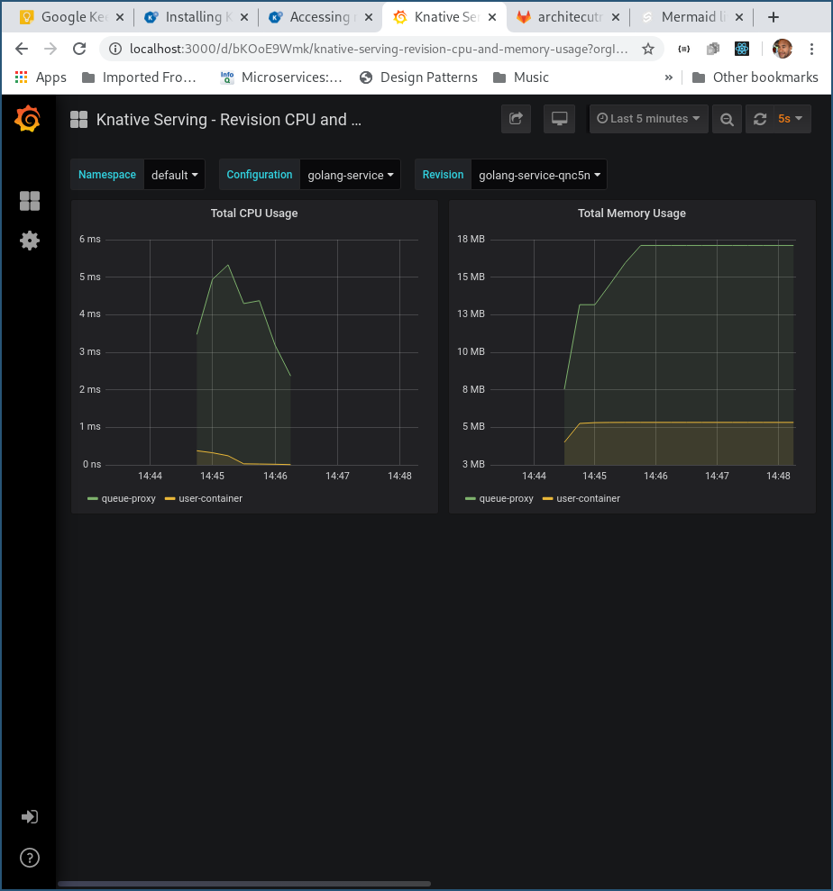

# Learning Knative

## Prerequisites

### Apple Mac OSX

- Docker for Mac
- Correctly configured [Docker for Mac](https://docs.docker.com/docker-for-mac/install/) instance
  
  - At least 3 CPUs
  - At least 5 GB of RAM
- Kubernetes development tools
  ```bash
  brew install kubectl
  brew install kind
  brew install istioctl
  brew install helm
  ```

### Linux

- Docker
  ```bash
  yay docker
  ```
- Kubernetes development tools
  ```bash
  yay kubectl
  yay kind
  yay istio
  yay helm
  ```

## Getting started

```bash
./local/dev

```

## Examples

1. Install example App
    ```bash
    kubectl apply -f ./examples/services.yaml
    ./examples/triggers
    kubectl wait ksvc node-service --for=condition=Ready
    ```
2. Browser to the example Node Site http://node-service.default.127.0.0.1.nip.io/
3. Post to example site
    ```bash
    curl -v "http://node-service.default.127.0.0.1.nip.io" -d '{}'
    ```
4. Watch event triggered containers auto-scale
    ```bash
    kubectl get pods
    kubectl logs -l serving.knative.dev/service=rust-service -c user-container -f
    [2020-08-21T18:08:29Z INFO  actix_server::builder] Starting 1 workers
    [2020-08-21T18:08:29Z INFO  actix_server::builder] Starting "actix-web-service-127.0.0.1:9000" service on 127.0.0.1:9000
    [2020-08-21T18:08:32Z INFO  rust_service] Received Event: Event { attributes: V10(Attributes { id: "6412f4cd-bff3-446e-89e6-2276f4e4e677", ty: "reply.to", source: "https://go-service/", datacontenttype: Some("application/json"), dataschema: None, subject: None, time: Some(2020-08-21T18:08:29.079284202Z) }), data: Some(Binary([123, 34, 105, 100, 34, 58, 57, 57, 44, 34, 109, 101, 115, 115, 97, 103, 101, 34, 58, 34, 104, 101, 108, 108, 111, 32, 102, 114, 111, 109, 32, 110, 111, 100, 101, 45, 115, 101, 114, 118, 105, 99, 101, 32, 45, 32, 72, 97, 110, 100, 108, 101, 100, 32, 98, 121, 32, 48, 32, 45, 32, 104, 101, 108, 108, 111, 32, 102, 114, 111, 109, 32, 103, 111, 45, 115, 101, 114, 118, 105, 99, 101, 34, 125])), extensions: {"knativehistory": String("default-kne-trigger-kn-channel.default.svc.cluster.local"), "knativearrivaltime": String("2020-08-21T18:08:29.080334597Z")} }
    [2020-08-21T18:08:32Z INFO  actix_web::middleware::logger] 10.244.0.9 "POST / HTTP/1.1" 200 84 "-" "Go-http-client/1.1" 0.000178
    ```
5. Inspect monitoring dashboard

    5.1 Start kubectl proxy
    ```bash
    kubectl port-forward --namespace knative-monitoring \
    $(kubectl get pods --namespace knative-monitoring \
    --selector=app=grafana --output=jsonpath="{.items..metadata.name}") \
    3000
    ```
    5.2 Browse to Grafana http://localhost:3000/

## Performance Results from sample application

### Node Service


### Python Service


### Golang Service


### Rust service


